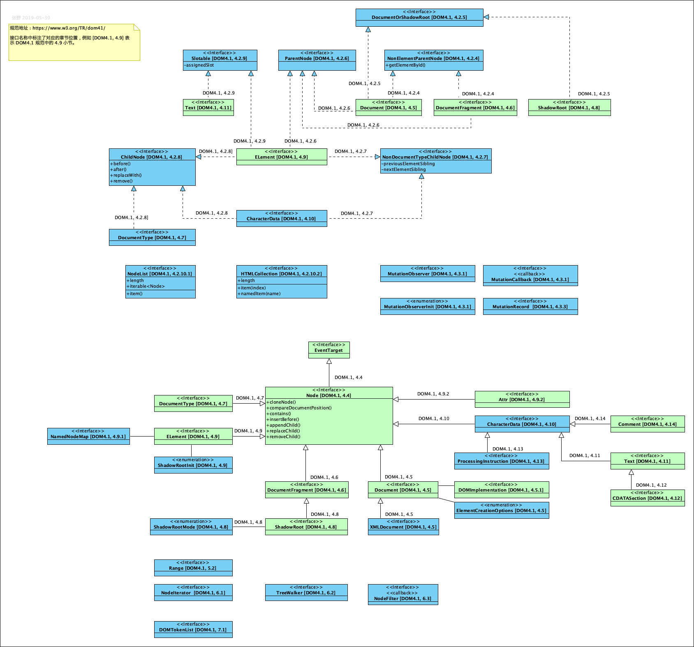
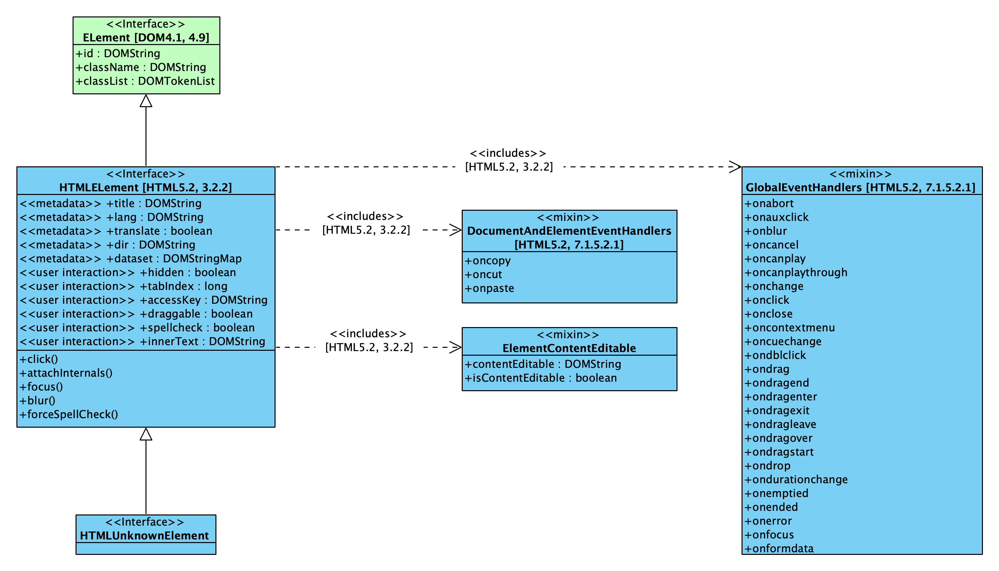
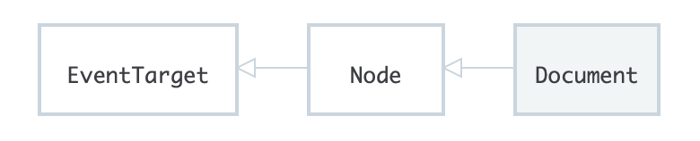
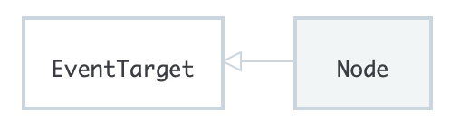
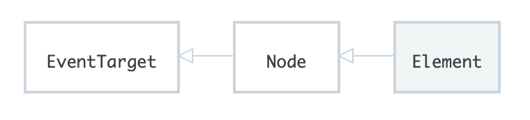

= DOM

DOM（Document Object Model，文档对象模型）是 HTML 和 XML 文档的编程接口，是对文档结构化的表述。脚本语言可以通过 DOM 来修改文档的结构、样式和内容。DOM 本身被设计为编程语言无关的，我们既可以使用JavaScript 来实现 DOM，也可以通过其他脚本语言（例如，Python，link:https://doc.servo.org/script/dom[Rust]）来实现。
在 HTML 规范中，DOM 的定义采用 link:https://heycam.github.io/webidl/[WebIDL] 的方式表述。详细的 DOM 定义可以参考 link:https://www.w3.org/TR/dom41/[W3C DOM 4.1]。HTML 规范中，对 link:https://www.w3.org/TR/dom41/[DOM 4.1] 中定义的部分接口进行了深度扩展。

在 DOM 4.1 规范中定义了接口 EventTarget、Node。以这两个接口为基类，扩展出了我们常见的 DOM 节点。这些节点类型的类型继承关系如下图所示。

在上图中可以看到，ELement 类型（在规范中，统一描述为「接口（interface）」，本文为了描述方便，使用“类型”一词）、Document 类型、DocumentFragment 类型、Attr 类型、Comment 类型、Text 类型都是 Node 类型的子类。
HTML5 中的所有 HTML 元素都必须实现一个基础接口，称为 HTMLELement。HTMLELement 接口与 DOM4.1 中定义的 Element 接口具有如下关系：

== 常见的 DOM 数据类型

|===
|数据类型（接口 | 解释

| Document（link:https://www.w3.org/TR/html52/dom.html#the-document-object[HTML 5.2规范]，link:https://www.w3.org/TR/dom41/#interface-document[DOM 4.1 规范]）
| 当一个成员返回一个 Document 类型的对象时，这个对象就是“根 document”对象。例如，一个元素的 ownerDocument 属性返回该元素所属的 Document 对象。DOM 参考手册中的 link:https://developer.mozilla.org/en-US/docs/Web/API/Document[document 章节]描述了该对象。

Document 接口的继承关系如下：

| Node（link:https://www.w3.org/TR/dom41/#interface-node[DOM 4.1 规范]）
| 文档中的每个对象都是某种类型的节点（Node），在一个 HTML 文档中，每个节点都是一个元素（Element）。

Node 接口的继承关系如下：

| Element（link:https://www.w3.org/TR/dom41/#interface-element[DOM 4.1规范]）
| 一个 DOM 元素实现了Element 接口和 Node 接口，在一个 HTML 文档中，element 对象的能力被 link:https://developer.mozilla.org/en-US/docs/Web/API/HTMLElement[HTMLElement] 接口以及其他特定元素的接口，进一步增强。例如，<table> 元素被 HTMLTableElement 接口进一步增强。

Element 接口的继承关系如下：

| NodeList（link:https://www.w3.org/TR/dom41/#interface-nodelist[DOM 4.1 规范]）
a| 一个 nodeList 是一个元素数组，就像 document.getElementsByTagName() 方法的返回值。

nodeList 中的每个项（item）可以通过如下方式访问：

- list.item(1)  
- list[1]

这两种方法是等价的，第一种方法，item 是 nodeList 对象上的一个方法。第二种方法，采用典型的数组语法访问第二个元素。

尽管 nodeList 不是数组，但是可以使用 forEach() 方法迭代每个元素。nodeList 还可以被 Array.from() 方法转换为数组。

详细的使用方法和注意事项，请参考link:https://developer.mozilla.org/en-US/docs/Web/API/NodeList[这里]。

| Attribute（link:https://www.w3.org/TR/dom41/#interface-attr[DOM 4.1 规范]）
| 当一个成员返回一个属性（attribute）时，该属性是一个对象引用，对外暴露了一些接口。在 DOM 中 attribute 也是节点，尽管我们很少这么使用。

| NamedNodeMap（link:https://www.w3.org/TR/dom41/#interface-namednodemap[DOM 4.1 规范]）
| 一个 namedNodeMap 像一个数组，但是其中的项（item）可以通过 name 或 index 访问。因为这些项在 namedNodeMap 中没有特定的顺序，所以通过 index 访问仅是为了方便。

可以通过 namedNodeMap 对象上的 item() 方法访问其中的项。还可以为 namedNodeMap 对象添加或移除项。

|===

=== DOM 中的核心接口

- document.getElementById(id)
- document.getElementsByTagName(name)
- document.createElement(name)
- parentNode.appendChild(node)
- element.innerHTML
- element.style.left
- element.setAttribute()
- element.getAttribute()
- element.addEventListener()
- window.content
- window.onload
- console.log()
- window.scrollTo()

许多 DOM 对象都实现了多个接口。例如，
不同浏览器对于 DOM API 的支持程度不尽相同，我们可以通过编写样例页面的方法测试相应的 API 是否功能正常。

=== 描述与 CSSOM 的关系。
[] 说明 CSSOM 规范的位置。

=== 扩展阅读

- DOM 介绍：https://developer.mozilla.org/en-US/docs/Web/API/Document_Object_Model/Introduction
- https://developer.mozilla.org/en-US/docs/Web/API/Document_Object_Model
- CSS Object Model (CSSOM)，https://developer.mozilla.org/en-US/docs/Web/API/CSS_Object_Model
